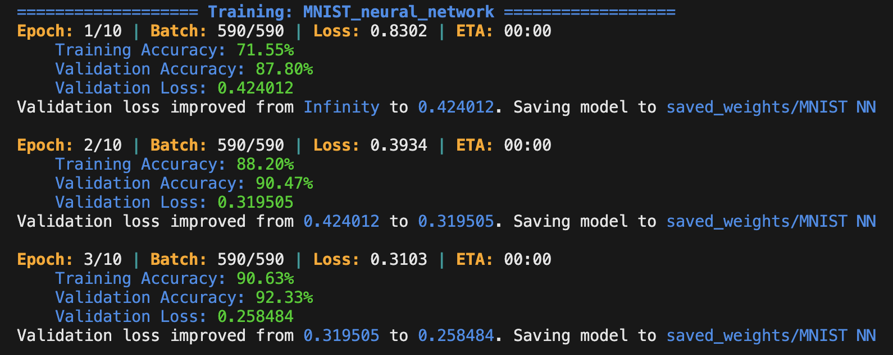

# JFlow  

**JFlow** is a memory-efficient deep learning library designed in Java for both educational purposes and real-world machine learning applications. It provides low-level control over model training and supports limited hardware.  

### Strengths  

#### Memory Optimization  
- **Low Memory Mode**: Train large models with limited resources (ideal for datasets larger than system memory).  
    - Example: **CIFAR-10 CNN**, 1M parameters, < 2GB RAM with low memory mode  
    - Example: **CIFAR-10 CNN**, 5M parameters, < 3GB RAM with low memory mode  

#### Low-level Control & Debugging  
- Clean, Keras-similar UI for model training.  
- Implement custom training steps easily.  
- Debug mode for inspecting gradients.  

### Key Features  

#### Dataloader  
- Load images from CSV or directory.  
- Train-test-split and data batching.  

#### Transform  
- Normalize and augment images with built-in functions.  

#### Sequential Model  
- Build models with a simple UI.  
    - High-level functions: train, predict.  
    - Low-level functions: forward(data), backward(data).  
- Save and load model weights.  

#### Supported Layers  
- **Dense**  
- **Conv2D**
- **MaxPool2D**
- **Upsampling2D**
- **BatchNorm**
- **Flatten**  
- **GlobalAveragePooling2D**

#### Supported Activation Functions  
- **ReLU**, **LeakyReLU**, **Sigmoid**, **Tanh**, **Softmax**, **Swish**, **Mish**.  
- **Custom Activation**: Easy to implement.  

#### Supported Optimizers  
- **SGD**, **AdaGrad**, **RMSprop**, **Adam**.  

#### Utilities  
- Plot images and confusion matrices.  
- JMatrix data type for low-level matrix operations.  

